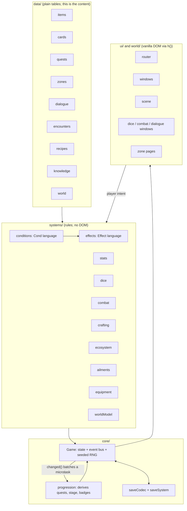
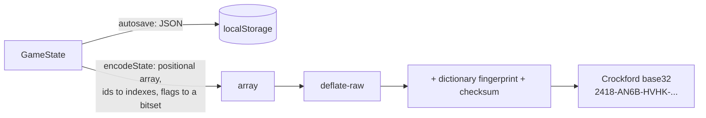

# Architecture

11:11 is about 15,000 lines of TypeScript with **no UI framework and no runtime dependencies beyond four web fonts**.
The whole game is a pure function of one serialisable state object plus a seeded random number generator, which is
what makes it testable, saveable in a 1.4 kB password, and replayable.

## The ideas that carry the design

**1. Content is data, rules are small.** Items, cards, quests, dialogue, memories and encounters are tables. They talk to
the engine through two tiny languages that every table shares:

- `Cond` (`{flag}`, `{has}`, `{stat, gte}`, `{know}`, `{time}`, `{all}`, `{any}`, `{not}` ...) decides whether something is
  available. `tests/properties.test.ts` checks it with property-based tests (De Morgan, double negation, identity).
- `Effect` (`{t:'item'}`, `{t:'stat'}`, `{t:'flag'}`, `{t:'ailment'}` ...) says what happens. One interpreter runs them all, so
  a dialogue choice, a card, a quest reward and a memory all change the world through the same code.

**2. The website is the world model.** `data/world.ts` describes every object as a set of dependencies with a tier of
understanding (0/1/2) and a mode (ALL / ANY / XOR). The Inspector, the Handbook, the page-source view, the terminal, the
`/dev/` gate and SYSTEM STATUS are all *views over the same graph*. Nothing in them is hand-written per screen, so they
cannot disagree with the game.

**3. Derived, not scripted.** Quests, the visual stage, badges and rumour verdicts are *derived* from state each time
anything changes (`core/progression.ts`). There is no quest log to keep in sync, which removes a whole class of bugs
(a quest you can neither finish nor fail).

**4. One source of randomness.** `core/random.ts` is a mulberry32 stream seeded from the world. Dice, crafting, the
foxfire trail, the Broken Homepage's puzzles and the maze all draw from it or from seed-derived streams, so a seed
replays identically and every puzzle is *fair by construction* (checked in `tests/gear.test.ts`).

**5. Tuning lives in one file.** `config/balance.ts` holds every number that affects difficulty or pacing. The pacing
pass (see the README) changed Knack tiers by editing three numbers there.

## Saving

A save **password** is about 1.4 kB because known ids become indexes into the id tables. That is compact but fragile, so
the password carries a 16-bit fingerprint of every table it depends on (`DICT_FINGERPRINT`). Load a password from a
different build and you get a clear message instead of silently misread progress. Autosave is plain JSON and is
unaffected. This was a bug found during a sweep: adding content had been quietly invalidating old passwords.

## Testing

| Layer | What | Where |
| --- | --- | --- |
| Static | ESLint (typescript-eslint), `tsc --noEmit`, bundle-size budget | `npm run lint`, `typecheck`, `size` |
| Unit | rules and data integrity | `tests/*.test.ts` (vitest) |
| Property | RNG, the condition language, save round trips, password versioning | `tests/properties.test.ts` (fast-check) |
| Content lint | every flag a gate reads is set somewhere; every knowledge id is defined | `tests/contentlint.test.ts` |
| End to end | the real UI, real clicks, real dice, per feature and a full playthrough | `tests/e2e/*.mjs`, `npm run e2e` |
| Accessibility | axe-core over every screen and both bosses | `tests/e2e/a11y.mjs` |
| Monkey test | random clicking through the whole unlocked game, with invariants | `tests/e2e/fuzz.mjs` |
| Offline | install the service worker, go offline, reload | `tests/e2e/offline.mjs` |

`npm run graph` regenerates `docs/content-graph.md` (what opens each place, and every quest) from the data tables.

## Decisions worth knowing about

- **Vanilla DOM, no framework.** The UI is an `h()` helper and `registerZone({ render })`. State changes batch into one
  microtask `changed()`, and windows re-render themselves. It keeps the bundle at 137 kB gzipped and the mental model small.
- **E2E drives the UI, not the API.** The unit tests cover rules, but the end-to-end suites click buttons and read dialogue,
  because the bugs that matter here (a hotspot covered by a toast, a window closed by a late refresh) only show up there.
  The occasional flake taught something: a test that opens a window right after closing a dialogue raced the dialogue's
  own refresh, and the fix was to wait, not to retry.
- **Personal content is a layer, not a fork.** `personal/*.json` is bundled through `import.meta.glob` and overrides the
  placeholder copy. Strangers see a complete game; a gift recipient sees their own memories and dedication.
- **Accessibility is tested, not asserted.** The first axe run found 19 serious or critical problems in a codebase that
  had been written carefully, which is the argument for keeping the check in CI.
