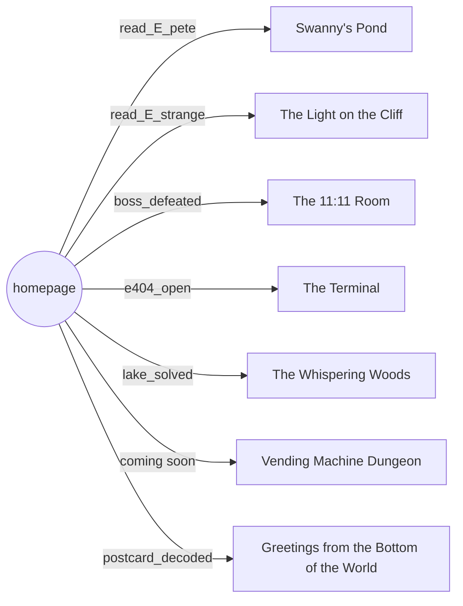

# Content graph

_Generated by `npm run graph` from the data tables. Do not edit by hand._

## The web ring: what opens each place

## Quests

| Quest | Starts when | Steps | Reward |
| --- | --- | --- | --- |
| **Visitor #73** | game_started | 1. Look around the homepage. _(visited_home)_ 2. Read the guestbook. _(visited_guestbook)_ 3. Find something that is not under construction. _(has yoghurt OR has swan_ticket OR ate_yoghurt)_ | hits +20 |
| **Wind Up the Swans** | read_E_pete | 1. Somebody left a ticket for the swan boats. _(has swan_ticket OR boat_ridden)_ 2. Find the pond. _(visited_lake)_ 3. Go for a pedal. _(boat_ridden)_ 4. Remember the song. _(lake_solved)_ | hits +60 |
| **The Foxfire Trail** | visited_forest | 1. Say hello to whoever lives in the woods. _(fern_met)_ 2. Follow the trail to the clearing. _(oak_found)_ 3. Count the rings of the Old Oak. _(tree_ring_taken)_ | card old_oak, hits +70 |
| **Greetings from the Bottom of the World** | visited_tasmania | 1. Meet whoever lives on the rocks. _(devil_met)_ 2. Find the five changes between the photographs. _(tas_diffs)_ 3. Tell the sky what it wants to hear. _(tas_aurora)_ | card aurora, hits +80 |
| **Something in the Reeds** | chocobo_noticed | 1. Befriend whatever is in the reeds. _(creature_met)_ 2. Earn its trust. _({"creature":{"id":"chocobo","field":"trust","gte":25}})_ | card peep, stat +1, hits +50 |
| **Where the Light Waits** | read_E_strange | 1. Work out who wrote the strange entry. _(deduction_solved)_ 2. Find the light. _(visited_lighthouse)_ 3. Wake the lamp. _(lamp_lit)_ 4. Read the postcard properly. _(postcard_decoded)_ | hits +60 |
| **One Extremely Important Yoghurt** | has_had_yoghurt | 1. It is for someone. _(knows yoghurt_has_destination)_ 2. Find who has been waiting. _(marl_asked_yoghurt)_ 3. Deliver it. _(yoghurt_delivered)_ | hits +40 |
| **Page Found** | clue_404 | 1. Open the page. Bring the useless key. _(e404_open)_ 2. Find your way through the dark. _(maze_goal)_ 3. Face VM-1111. _(boss_defeated)_ | hits +100 |
| **Who Is Visiting?** | 100+ visitors | 1. Reach 250 visitors. _(250+ visitors)_ 2. Reach 500 visitors. _(500+ visitors)_ 3. Reach 777 visitors. _(777+ visitors)_ 4. Reach 1,111 visitors. _(1111+ visitors)_ |  |

7 places on the ring, 9 quests, 15 pages in all.
